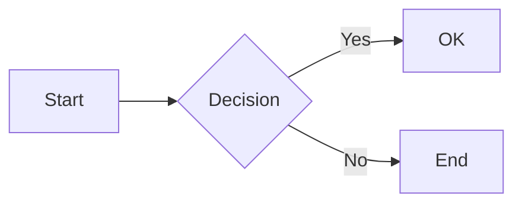

# md2typst

A robust Markdown to [Typst](https://typst.app/) converter in Python with support for multiple Markdown parsers.

## Features

- **Multiple parser backends**: Choose from markdown-it-py, mistune, or marko at runtime
- **GFM support**: Tables, strikethrough, and other GitHub Flavored Markdown extensions
- **Math support**: `$...$` and `$$...$$` rendered via [mitex](https://typst.app/universe/package/mitex/), enabled by default
- **Mermaid diagrams**: ` ```mermaid ` code blocks rendered via [mmdr](https://typst.app/universe/package/mmdr/)
- **Auto-imports**: Required Typst packages are automatically imported based on content
- **Direct PDF output**: `md2pdf` command converts Markdown to PDF in one step (requires `typst` CLI)
- **Diagram blocks**: ` ```diagram ` keeps ASCII-art diagrams from breaking across pages
- **Configurable**: User config, project config, YAML front matter, and CLI options with clear cascade
- **Extensible**: Plugin support for parser-specific extensions
- **Well-tested**: Comprehensive test suite with TCK validation against CommonMark

## Installation

```bash
# Using pip
pip install md2typst

# Using uv
uv add md2typst
```

## Quick Start

### Command Line

```bash
# Convert a file (writes input.typ by default)
md2typst input.md

# Explicit output path
md2typst input.md -o output.typ

# Output to stdout
md2typst input.md -o -

# Convert from stdin (outputs to stdout)
echo "# Hello **World**" | md2typst

# Use a specific parser
md2typst --parser mistune input.md

# Convert directly to PDF (requires typst CLI)
md2pdf input.md
md2pdf input.md -o custom-output.pdf

# List available parsers
md2typst --list-parsers
```

### Python API

```python
from md2typst import convert

# Simple conversion
typst = convert("# Hello **World**")
print(typst)
# Output: = Hello *World*

# With specific parser
typst = convert("~~deleted~~", parser="mistune")
print(typst)
# Output: #strike[deleted]

# With configuration
from md2typst import convert_with_config
from md2typst.config import Config

config = Config(parser="marko", plugins=["gfm"])
typst = convert_with_config("| A | B |\n|---|---|\n| 1 | 2 |", config)
```

## Supported Parsers

| Parser | CLI Name | Description |
|--------|----------|-------------|
| [markdown-it-py](https://github.com/executablebooks/markdown-it-py) | `markdown-it` | Default. CommonMark compliant, extensible |
| [mistune](https://github.com/lepture/mistune) | `mistune` | Fast, pure Python |
| [marko](https://github.com/frostming/marko) | `marko` | CommonMark compliant, extensible |

All parsers have GFM extensions (tables, strikethrough) enabled by default.

## Markdown to Typst Mapping

| Markdown | Typst |
|----------|-------|
| `# Heading` | `= Heading` |
| `## Heading 2` | `== Heading 2` |
| `*italic*` | `_italic_` |
| `**bold**` | `*bold*` |
| `~~strike~~` | `#strike[strike]` |
| `` `code` `` | `` `code` `` |
| `[text](url)` | `#link("url")[text]` |
| `` | `#image("url", alt: "alt")` |
| `> quote` | `#block(...)[quote]` |
| `$E=mc^2$` | `#mi("E=mc^2")` |
| `$$...\int...$$` | `#mitex(\`...\`)` |
| `---` | `#line(length: 100%)` |
| GFM tables | `#table(...)` |
| ` ```mermaid ` | `#mermaid("...")` |
| ` ```diagram ` | `#block(breakable: false)[...]` |

## Configuration

Configuration is loaded from multiple sources (highest priority first):

1. CLI arguments (`--parser`, `--plugin`, ...)
2. Front matter in the document
3. Explicit config file (`--config path/to/config.toml`)
4. `md2typst.toml` in the current or parent directories
5. `[tool.md2typst]` section in `pyproject.toml`
6. User config at `~/.config/md2typst/config.toml` (platform-specific via `platformdirs`)
7. Built-in defaults

### Styling with `[style]`

The `[style]` section customizes Typst's default output. Set your preferred font, language, and page layout **once** in your user config — applied to every document you convert.

**`~/.config/md2typst/config.toml`**:
```toml
[style]
# Font as single string or a fallback list
font = ["Libertinus Serif", "New Computer Modern", "Times New Roman"]
font_size = "11pt"
language = "en"
paper = "a4"
margin = "2.5cm"

# Raw Typst code appended after structured fields
preamble = """
#set par(justify: true, first-line-indent: 1em)
#show heading.where(level: 1): it => { it; v(0.5em) }
"""
```

This generates at the top of every converted document:
```typst
#set text(font: ("Libertinus Serif", "New Computer Modern", "Times New Roman"), size: 11pt, lang: "en")
#set page(paper: "a4", margin: 2.5cm)

#set par(justify: true, first-line-indent: 1em)
#show heading.where(level: 1): it => { it; v(0.5em) }
```

### Example Configuration

**md2typst.toml** (project-level, overrides user config):
```toml
parser = "mistune"
plugins = ["strikethrough", "table"]

[parser_options]
html = true

[style]
language = "fr"
```

**pyproject.toml**:
```toml
[tool.md2typst]
parser = "markdown-it"
plugins = ["gfm"]
```

### Front Matter

Markdown files can include YAML front matter. Any field is exposed as a `#let doc-<key>` variable in Typst, **except** reserved keys with special handling:

- `preamble` — raw Typst code, concatenated with config `style.preamble`
- `stylesheet` / `stylesheets` — additional Typst modules to import
- `font`, `font_size`, `language`, `paper`, `margin` — override the corresponding `[style]` fields at document level

```markdown
---
title: My Document
author: Jane Doe
language: fr          # overrides config style.language
font: EB Garamond     # overrides config style.font
stylesheet: my-style
preamble: |
  #set par(justify: true)
  #show heading.where(level: 1): it => { it; v(0.5em) }
---

# Hello World
```

This generates:

```typst
#let doc-title = "My Document"
#let doc-author = "Jane Doe"

#import "my-style.typ": *

#set text(font: "EB Garamond", lang: "fr")

#set par(justify: true)
#show heading.where(level: 1): it => { it; v(0.5em) }

= Hello World
```

The output ordering is: variables, stylesheet imports, package imports, `#set` directives from `[style]`, preamble, then content.

### Math

Dollar-sign math syntax is enabled by default (markdown-it and mistune parsers). The [mitex](https://typst.app/universe/package/mitex/) package import is added automatically when math is detected.

```markdown
Inline: $E = mc^2$

Display:
$$
\int_0^\infty e^{-x^2} dx = \frac{\sqrt{\pi}}{2}
$$
```

### Mermaid Diagrams

Fenced code blocks with language `mermaid` are converted to native Typst diagrams using the [mmdr](https://typst.app/universe/package/mmdr/) package. The import is added automatically.

````markdown

````

### Diagram Blocks

Use ` ```diagram ` for ASCII-art or box-drawing diagrams that must not break across pages:

````markdown
```diagram
┌──────────┐       ┌──────────┐
│  Client  │──────▶│  Server  │
└──────────┘       └──────────┘
```
````

The content is wrapped in `#block(breakable: false)` in the Typst output.

### CLI Options

```bash
md2typst --help

Options:
  -o, --output FILE      Output file (default: <input>.typ, or stdout for stdin)
  -p, --parser NAME      Parser to use (markdown-it, mistune, marko)
  --plugin NAME          Load parser plugin (can be repeated)
  --stylesheet NAME      Import Typst stylesheet (can be repeated)
  --config FILE          Path to configuration file
  --list-parsers         List available parsers
  --show-config          Show effective configuration
  --debug                Show debug info (config sources, generated Typst)
```

## Development

### Setup

```bash
git clone https://github.com/user/md2typst.git
cd md2typst
uv sync
```

### Running Tests

```bash
# Run all tests (benchmarks skipped by default)
uv run pytest

# Run by category
uv run pytest -m unit          # Unit tests (fast)
uv run pytest -m integration   # Integration tests
uv run pytest -m e2e          # End-to-end tests
uv run pytest -m benchmark    # Benchmark tests
```

### Test Structure

```
tests/
├── a_unit/           # Unit tests (AST, generator)
├── b_integration/    # Integration tests (parsers, config, TCK)
├── c_e2e/           # End-to-end tests
├── d_benchmark/     # Performance benchmarks
└── fixtures/        # Test fixtures (CommonMark, GFM)
```

### Code Quality

```bash
# Type checking
uv run mypy src/

# Linting
uv run ruff check src/

# Formatting
uv run ruff format src/
```

## Architecture

```
Markdown Input → Parser → AST → Generator → Typst Output
```

The converter uses a parser-agnostic AST (Abstract Syntax Tree) that decouples parsing from code generation. This allows:

- Swapping parsers without changing the generator
- Consistent output regardless of parser choice
- Easy extension with new parsers

## License

MIT

## Contributing

Contributions are welcome! Please:

1. Fork the repository
2. Create a feature branch
3. Add tests for new functionality
4. Ensure all tests pass
5. Submit a pull request
